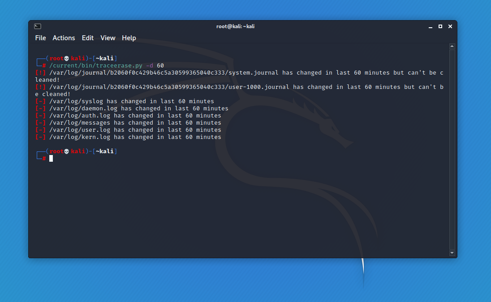
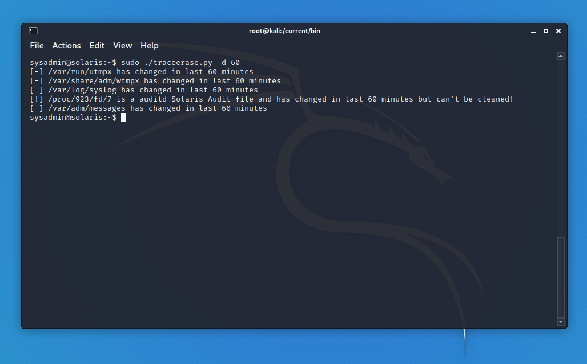
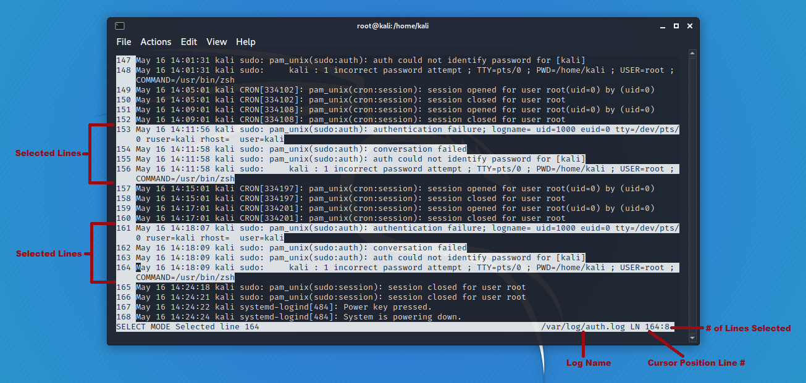
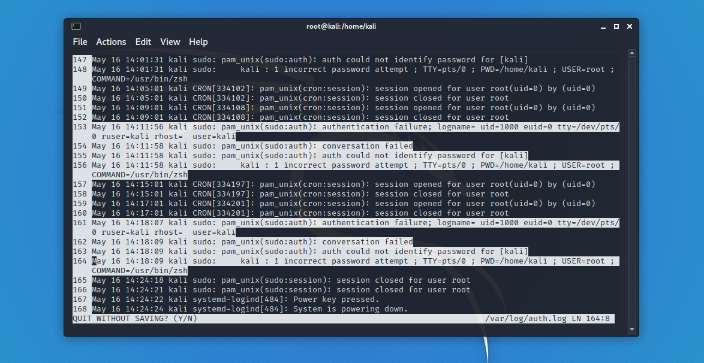
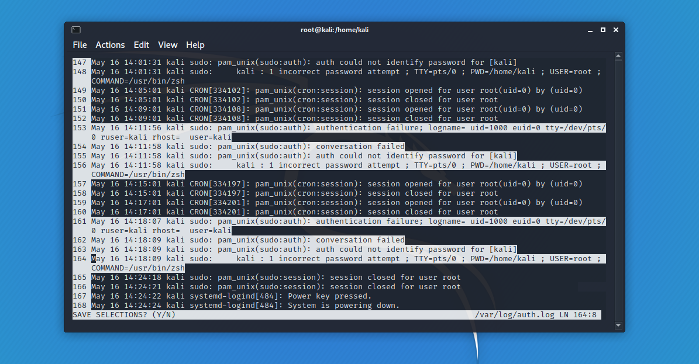

DISCLAIMER: This tool is meant for authorized red teaming, penetration testing, messing around with your own machines, or other LEGAL uses. ANY illegal use of this code is made against the author's intentions and wishes.

# TRACEERASE
TRACEERASE is a tool designed to clean various Unix logs. As of now, it can clean ASCII logs that adhere to the syslog RFC3164 format, utmp-formatted binary logs (utmp, wtmp, btmp, lastlog), and utmpx (Solaris) binary logs (utmpx, wtmpx, btmpx, and lastlog). Other log types may be implemented in the future. TRACEERASE features a custom built-in log viewer for selecting individual dirty lines, smart timestamp manipulation (atime, mtime, sometimes ctime), automatically adding newly-generated log entries back into the log even after it's been opened, automated discovery of log files based on running processes and common log locations, and memory-only execution. The only thing written to disk is the script itself. It also relies very little on system binaries, instead using Python's built-in functionality, to avoid depending on tools like `utmpdump` or `grep`. The tool is built entirely on the Python 3 standard library to avoid having to import 3rd party modules on the system (except for colorama, but it'll run without it). Basically, if the system has Python 3 installed, it should be able to run this script.

## Background
I originally started writing this as a way to get into more advanced Python scripting and to learn more about Unix logging. I noticed that most other scripts on GitHub and elsewhere either cleaned any instance of an IP address or username from a log, or wiped the log entirely. The latter is obviously easy to implement, but also easy to catch (what stands out more to sysadmins and cybersecurity analysts than empty logs??). The former was a bit harder to write, but also seemed to be too heavy-handed for something as surgical as log tampering. What if you're using stolen credentials to log in as a legitimate user through SSH? Maybe you fat-fingered the password once and ended up in the btmp log, but the admin who's creds you stole forgets his password every couple days. He's created more entries in the btmp log than you have. The goal of log tampering is to restore the logs to the same state they were in before you interacted with the system, but wiping all instances of that user is cleaning a mess you didn't make, and creating a log state that didn't previously exist. TRACEERASE avoids this by allowing the user to clean individual lines from logs, making sure you remove your IOCs, and nothing else.

# How It Works
TRACEERASE has two modes, 'discover' and 'erase'.

## Discover Mode
Discover (`-d`) will start by determining the OS. The methods differ between Linux and Solaris, but both use branching logic, check open file descriptors based on flagged process names to find logs on the system that can be cleaned, search common log locations, and then see if those log files have updated in the past 'n' minutes (set by your `-d` value). For Linux, this works really well because the file descriptors in `/proc/<pid>/fd/*` are symlinks pointing to files elsewhere on the filesystem. This makes it possible to find logs files being written to anywhere on the filesystem without having to walk the whole thing, saving system resources and time.

*Linux Discover Mode*

Solaris was a much harder problem because its file descriptors are not symlinks, but hard links. TRACEERASE works around this by searching common log locations and comparing inodes for those files against the inodes in the file descriptors. This helps identify exact log names, but that's not necessary to clean the logs. Finding logs through file descriptors gives enough information to see if the file is cleanable (process name and filetype), even if the filename itself is unknown.

*Solaris Discover Mode*

### Discover by Process
Discover mode can also be used to check individual processes with the `-p` option. You can list any number of process IDs, and TRACEERASE will check if they've updated any of the files listed in their file descriptors in the last 'n' minutes (set by your `-d` value). This is useful if there is a weird process running that looks like it might log but isn't in the 'flagged' list of processes that TRACEERASE automatically checks against.

## Erase Mode
Erase mode (`-f`) is the main point of this tool. It allows you to specify an individual file you would like to clean. Once a log file is identified, a hash will be made and its contents read into memory (either line by line or by chunks), displayed in the log viewer for viewing and dirty line selection, and then cleaned and timestomped.

### Custom Log Viewer

Full disclosure, I can't take a lot of credit for this, I pulled a lot of code from [tdryer's excellent curses-based text editor](https://github.com/tdryer/editor). There are a number of changes, however, since the intended usage is much different. The <kbd>&#8593;</kbd> and <kbd>&#8595;</kbd> arrow keys are used for cursor movement, along with <kbd>PgUp</kbd>, <kbd>PgDn</kbd>, <kbd>Home</kbd>, and <kbd>End</kbd>. The <kbd>SPACEBAR</kbd> is used to select or unselect lines. Selected lines are highlighted.

*Select Mode*

<kbd>Q</kbd> will quit without saving your selections:
*Quitting*

<kbd>ENTER</kbd> will save your selections for cleaning.
*Saving*

The selections will then be presented to the user for final approval. The user can choose to reopen the log if selections need to change, or choose to proceed and clean the specified lines.

### Automatic Cleaning

Once the lines are selected, they'll be removed from the in-memory version of the file. A new hash will be made of the original log file and compared with the one taken at the start of the script to determine if any new entries have been made while you were using the tool (for active machines, this is very likely). If there are any changes, the tool will automatically append the new lines to the end of your "clean" version and then overwrite the original log. If the `wtmp` file was changed, TRACEERASE will automatically adjust `lastlog` to match and touch back necessary timestamps as well.

### Smart atime/mtime Manipulation

In an effort to manage expectations for TRACEERASE, actually hiding from forensic investigators by manipulating timestamps is basically a waste of time. Changing ctime to match mtime helps (see below), but even that is not 100% effective, and a little dangerous. Instead, the goal of timestamp manipulation should be to avoid leaving an easy-to-detect IOC that gets a forensic investigator called in the first place. Once a file is created, mtime only updates when the contents of the file change, so it's a blantant IOC if the timestamp on the last entry in a log doesn't match the mtime on the file. Fortunately, Python makes atime and mtime manipulation trivial with the standard `os` library.

TRACEERASE will automatically use the timestamp of the last log entry of the cleaned file as the new mtime, making sure that a cursory `tail`'ing of the log and an `ls` of the directory won't raise alarms. If the log entry only keeps timestamps down to the second, but the filesystem stores a more accurate value (like ext4 with nanoseconds) in its file timestamps, TRACEERASE will add random values to the end of the log timestamp to make it fit. This avoids the very gross look of having a manipulated log mtime with nine trailing zeros that even the dumbest admin could find with a bash one-liner. Still, it won't look good when running `stat` because the mtime and ctime will not line up (see below), but it will pass the `ls` test and avoid closer inspection in the first place, which is effectively just as good.

### Smart ctime Manipulation

**Warning! The method used for ctime manipulation is editing data in the inode table. I haven't had any issues in testing yet, but it is possible to corrupt the filesystem.**

The `debugfs` tool, usually installed on ext2-4 filesystems, can manipulate the ctime stored in the inode table. From what I've seen in testing, you shouldn't attempt this if the file is opened by another process; it seems you can't flush the cached inode table (which is the ctime you see in the `stat` command) and update it with the value placed in the inode table by `debugfs` if a process has a handle on the file. TRACEERASE does not keep a handle on the file, it is only opened when first reading the contents into memory and then when overwriting it, so it will not cause issues with `debugfs`.

Fortunately, there isn't much need to edit the ctime for most log files. ctime will update anytime the mtime changes, so if a log is written to frequently, the ctime will change when the next entry is added, removing your IOC. The only scenario where changing the ctime might be worth the risk is with logs that are rarely written to, like the btmp log. In that case, the reward might outway the risks, otherwise, almost certainly not.

## How Logs are Read

### ASCII logs

Need to write.

### utmp Binary Logs

TRACEERASE has a built-in utmp binary reader to avoid relying on any native programs on the target machine. Below is the struct code:
```python
'''
struct utmp {
    short   ut_type;              /* Type of record */
    pid_t   ut_pid;               /* PID of login process */
    char    ut_line[UT_LINESIZE]; /* Device name of tty - "/dev/" */
    char    ut_id[4];             /* Terminal name suffix, or inittab(5) ID */
    char    ut_user[UT_NAMESIZE]; /* Username */
    char    ut_host[UT_HOSTSIZE]; /* Hostname for remote login, or kernel version for run-level messages */
    struct  exit_status ut_exit;  /* Exit status of a process marked as DEAD_PROCESS; not used by Linux init (1 */
    /* The ut_session and ut_tv fields must be the same size when compiled 32- and 64-bit. 
       This allows data files and shared memory to be shared between 32- and 64-bit applications. */
    #if __WORDSIZE == 64 && defined __WORDSIZE_COMPAT32
    int32_t ut_session;           /* Session ID (getsid(2)), used for windowing */
    struct {
        int32_t tv_sec;           /* Seconds */
        int32_t tv_usec;          /* Microseconds */
    } ut_tv;                      /* Time entry was made */
    #else
    long   ut_session;           /* Session ID */
    struct timeval ut_tv;        /* Time entry was made */
    #endif
    int32_t ut_addr_v6[4];        /* Internet address of remote host; IPv4 address uses just ut_addr_v6[0] */
    char __unused[20];            /* Reserved for future use */
};
'''
UTMP_STRUCT = struct.Struct('hi32s4s32s256shhiii4i20s')
```

### utmpx Binary Logs

```python
'''
struct timeval32
{
  int tv_sec, tv_usec;
};

struct futmpx {
  char    ut_user[32];      /* user login name */
  char    ut_id[4];         /* inittab id */
  char    ut_line[32];      /* device name (console, lnxx) */
  pid32_t ut_pid;           /* process id */
  int16_t ut_type;          /* type of entry */
  struct {
    int16_t e_termination;  /* process termination status */
    int16_t e_exit;         /* process exit status */
  } ut_exit;                /* exit status of a process */
  struct timeval32 ut_tv;   /* time entry was made */
  int32_t ut_session;       /* session ID, user for windowing */
  int32_t pad[5];           /* reserved for future use */
  int16_t ut_syslen;        /* significant length of ut_host */
  char    ut_host[257];     /* remote host name */
};
'''
UTMPX_STRUCT = struct.Struct('32s4s32sih6xiii20x2x16s20x222x')
```

## Meme
For those who read the whole README, here's a meme:

Intern: How did you know the hacker was from Bel-Air?  
IR Analyst:  
Because he left...  
( •\_•)  
( •\_•)>⌐■-■  
fresh prints  
(⌐■\_■)  
YYYYEEEEEEEEEAAAAAAAAHHHHHHHHHHHHH  
